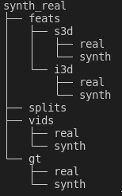

# HKI dataset 
[Project Website](https://c-patsch.github.io/HKI/)  

We provide the dataset here:  [HKI Dataset](https://tumde-my.sharepoint.com/:u:/g/personal/constantin_patsch_tum_de/ES6VYdY1R0lNspPVdxSvC7sB8Q4s_EFUjguHURRvv--DLg?e=p8pLdB)
  
# Dataset Description

Due to the inherent domain shift between the synthetic
and real data, we introduce a new egocentric dataset called
Human Kitchen Interactions (HKI) to investigate the sim-to-real gap.  
Our dataset contains in total 100 synthetic and
real videos in which 21 different actions are executed in a
kitchen environment. The synthetic data is acquired in an
egocentric virtual reality (VR) setup while capturing the virtual
environment in a game engine.  
We evaluate state-of-the-art
online action detection models on our dataset and provide
insights into sim-to-real domain shift. 


# Data Structure
The dataset has the following structure:  


 
 
The feats folder contains the synthetic and real features of the respective backbone models I3D and S3D.  
   
The gt folder contains the ground truth for the synthetic and real videos, where each line in the respective .txt file indicates the annotation for a frame within the video.  
  
The vids folder contains all of the synthetic and real videos.  
  
The splits file contains all the necessary splits to keep the evaluation the same with respect to the results of our paper. The test split remains constant throughout the varying experiments.  
The mapping.txt file maps the label names to the respective line numbers.

# Citation


```
@inproceedings{patsch2024sim,
  title={Sim-to-Real Domain Shift in Online Action Detection},
  author={Patsch, Constantin and Torjmene, Wael and Zakour, Marsil and Wu, Yuankai and Salihu, Driton and Steinbach, Eckehard},
  booktitle={2024 IEEE/RSJ International Conference on Intelligent Robots and Systems (IROS)},
  year={2024}
}
```


